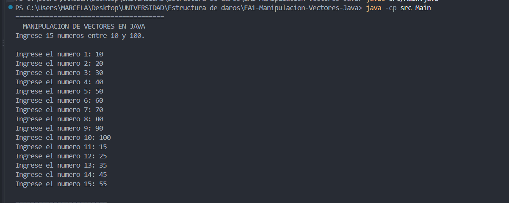
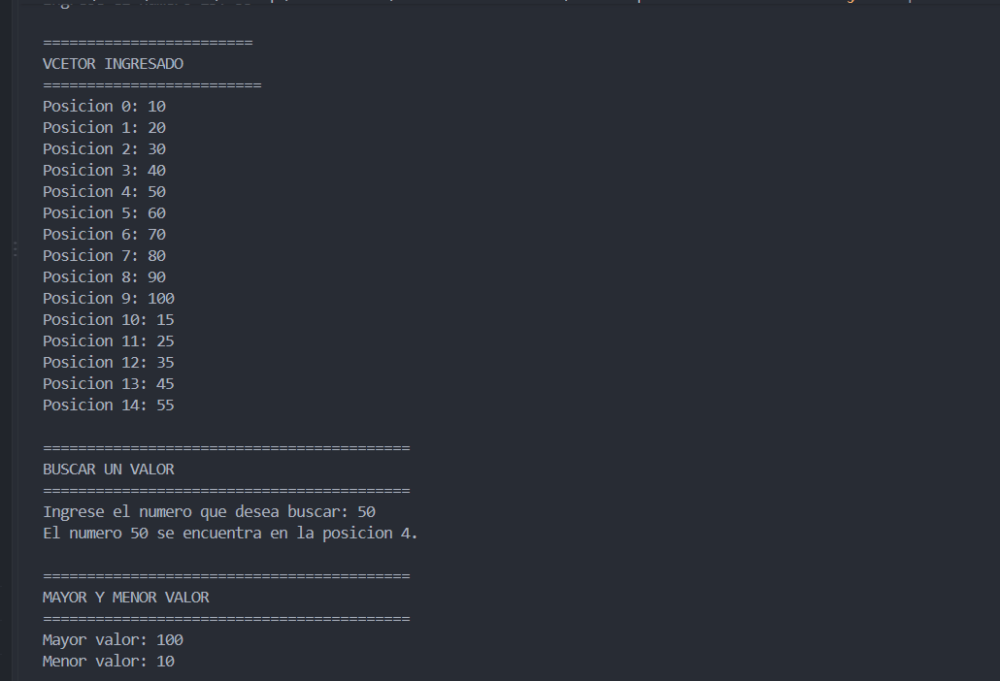
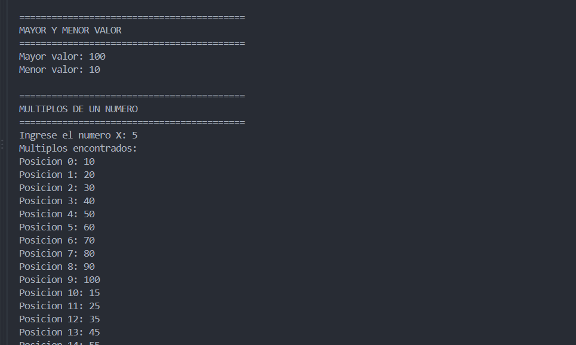
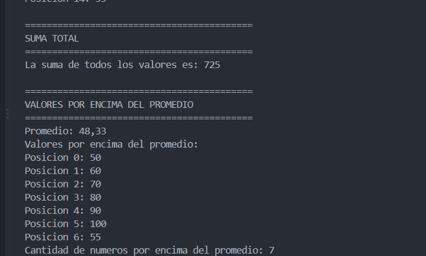

# EA1 - Manipulación de Vectores en Java

## Datos de la actividad

**Materia:** Estructura de Datos
**Actividad:** EA1. Manipulación de Vectores en Java
**Lenguaje:** Java
**JDK:** Eclipse Temurin
**Entorno de desarrollo:** Visual Studio Code

## Objetivo

Practicar el manejo de vectores en Java mediante diferentes operaciones como la búsqueda de valores, identificación del mayor y menor, búsqueda de múltiplos, cálculo de la suma y creación de un nuevo vector con los valores que se encuentran por encima del promedio.

## Funcionalidades

El programa realiza las siguientes operaciones:

1. Crea un vector de 15 números enteros.
2. Solicita valores entre 10 y 100 y valida que estén dentro del rango.
3. Muestra el vector completo en la consola.
4. Permite buscar un número dentro del vector y muestra su posición.
5. Determina el valor mayor y el valor menor.
6. Identifica los múltiplos de un número X.
7. Calcula la suma total de los valores.
8. Calcula el promedio.
9. Crea un nuevo vector con los números que están por encima del promedio.
10. Muestra la cantidad de números que están por encima del promedio.

## Tecnologías utilizadas

* Java
* Eclipse Temurin JDK
* Visual Studio Code
* Git
* GitHub

## Cómo ejecutar el proyecto

Abrir una terminal en la carpeta principal del proyecto.

### Compilar

```bash
javac src/Main.java
```

### Ejecutar

```bash
java -cp src Main
```

## Prueba realizada

Para comprobar el funcionamiento del programa se utilizaron los siguientes valores:

`10, 20, 30, 40, 50, 60, 70, 80, 90, 100, 15, 25, 35, 45, 55`

Número utilizado para la búsqueda:

`50`

Número utilizado para comprobar múltiplos:

`5`

Con esta prueba el programa permite comprobar la creación del vector, la validación de datos, la búsqueda, el mayor y menor valor, los múltiplos, la suma, el promedio y el nuevo vector.

## Capturas de pantalla









## Autor

Marcela
